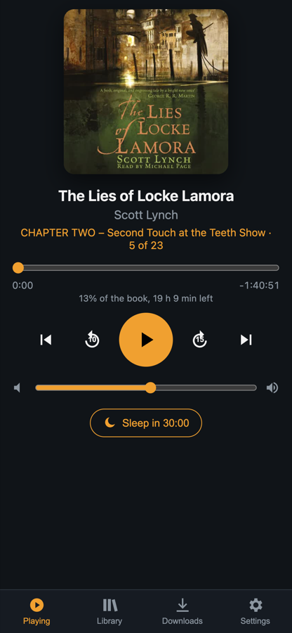
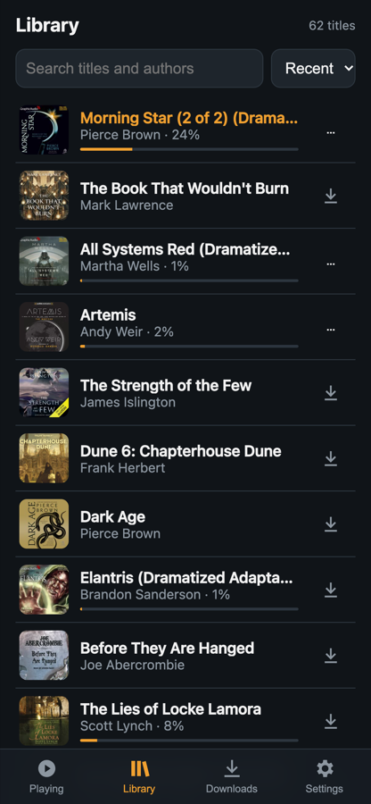
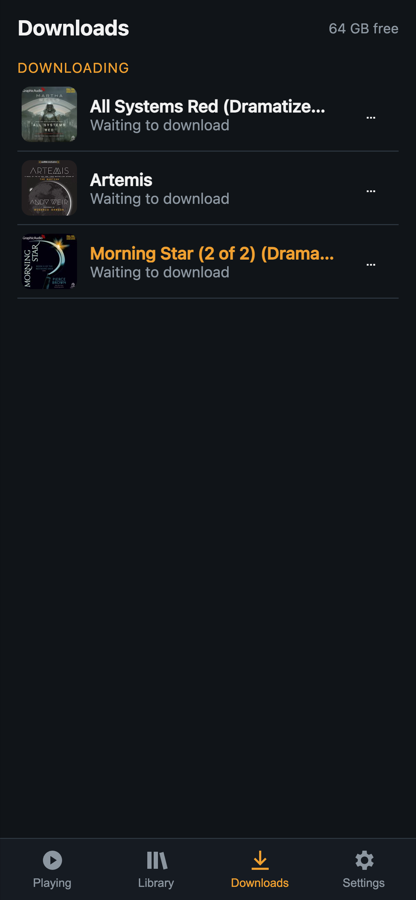
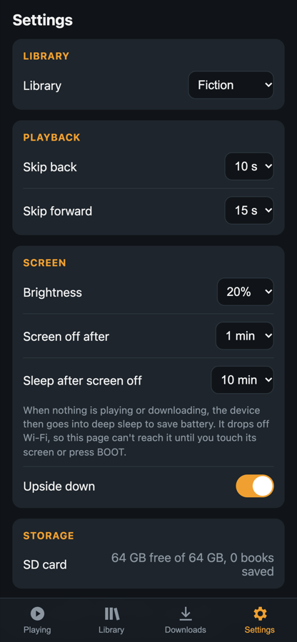

<p align="center"></p>

# ABSpresso

An espresso-sized audiobook player for [Audiobookshelf](https://www.audiobookshelf.org/). It runs
on an inexpensive ESP32-S3 board with a 1.85" round touchscreen and a built-in speaker, streams
your books and podcasts over Wi-Fi, and keeps your listening progress in sync with the server, so
you can pick up where you left off here, on your phone or on the web.

It's meant for the desk or the bedside table: a dedicated "carry on with my book" device, with no
phone needed.

**[Download the latest release](https://github.com/tomekent/ABSpresso/releases/latest)**

> **Disclaimer:** this project was created with [Claude Code](https://claude.com/claude-code),
> Anthropic's AI coding agent, working directly against the hardware: building, flashing and
> reading the serial logs with ESP-IDF to bring up the board, the audio pipeline and the UI. It
> has only been tested on the one board described below; review it before relying on it.

## Features

- **Streams from your server**: audiobooks and podcasts, in any format Audiobookshelf can serve.
  Progress syncs every 20 s and on pause, seek and stop.
- **Home**: Continue Listening, Recently Added and Downloaded shelves of cover art.
- **Library**: browse by cover, as an A-Z list of books, or by author. Drag the ring on the right
  edge to jump through the alphabet.
- **Now Playing**: cover art backdrop, a progress arc to scrub through the chapter, a volume arc,
  skip back/forward and previous/next chapter.
- **Sleep timer**: pause after 15, 30, 45 or 60 minutes of listening, or at the end of the chapter,
  fading out over the last seconds. The **Zz** button on Now Playing steps through the choices and
  then shows the minutes left; it can also be set from the remote control.
- **Podcasts**: shows list their episodes (in progress first, then newest); episodes play and
  sync like books.
- **Multiple libraries**: switch between the server's libraries from Settings.
- **SD card (optional)**: caches the library and covers for instant start-up and offline
  browsing, and holds downloaded books for offline listening. Progress made offline is sent to the
  server when it's back in reach.
- **Setup from your phone**: the device runs its own Wi-Fi network with a QR code to join. Sign
  in with your Audiobookshelf username and password; no API key needed.
- **Battery aware**: battery level and charging state in the status row, a dimming screen, screen
  off, and deep sleep when idle.
- **Physical controls**: BOOT plays and pauses, or puts the device to sleep when held.
- **Remote control from your phone**: open `http://abspresso.local` on the same Wi-Fi for Now
  Playing, the library, downloads and settings. Add it to the home screen and it works like an app.
- Accented characters, Cyrillic and Vietnamese titles display correctly.

## Screenshots

Captured on the device itself.

| Home | Recently Added | Library: covers | Library: books |
| :---: | :---: | :---: | :---: |
|  |  |  |  |
| **Authors** | **Now Playing** | **Settings** | **Book details** |
|  |  |  |  |

| Browsing covers | Resuming a book | A-Z scrubbing |
| :---: | :---: | :---: |
|  |  |  |

## Getting started

### What you need

- A **[Waveshare ESP32-S3-Touch-LCD-1.85C](https://docs.waveshare.com/ESP32-S3-Touch-LCD-1.85C)**
  (16 MB flash, 8 MB PSRAM). Both the **V1** and **V2** audio hardware are supported and detected
  automatically; see [Hardware](#hardware).
- An **Audiobookshelf server** that the device can reach over 2.4 GHz Wi-Fi.
- Optional: a microSD card (FAT formatted) for caching and downloads, and a 3.7 V LiPo battery
  with an MX1.25 connector.

### Option 1: flash a release

Download the files from the **[latest release](https://github.com/tomekent/ABSpresso/releases/latest)**
(currently [v0.1.1](https://github.com/tomekent/ABSpresso/releases/tag/v0.1.1)):

- `abspresso-<version>-full.bin`: a single image for a **new device**. It also clears saved
  settings.
- `abspresso-<version>-parts.zip`: separate files for **updating** a device while keeping its
  Wi-Fi and sign-in.

**In a browser** (Chrome or Edge): open Espressif's [ESP Tool](https://espressif.github.io/esptool-js/),
connect to the board, add the `-full.bin` file at address `0x0`, and program.

**With [esptool](https://docs.espressif.com/projects/esptool/)** (`pip install esptool`):

```sh
# New device
esptool.py --chip esp32s3 -b 460800 write_flash 0x0 abspresso-v0.1.1-full.bin

# Update, keeping settings (in the unzipped parts folder)
esptool.py --chip esp32s3 -b 460800 write_flash --flash_mode dio --flash_freq 80m --flash_size 16MB \
    0x0 bootloader.bin 0x8000 partition-table.bin 0x10000 abspresso.bin
```

If the board isn't detected, hold **BOOT**, press **RST**, release BOOT, and try again. Press RST
after flashing.

### Option 2: build from source

You need [ESP-IDF](https://docs.espressif.com/projects/esp-idf/en/v5.5/esp32s3/get-started/)
**v5.5** (developed on 5.5.2). LVGL and the other components are fetched on the first build.

```sh
git clone https://github.com/tomekent/ABSpresso.git && cd ABSpresso
. $IDF_PATH/export.sh
idf.py set-target esp32s3     # first time only
idf.py -p /dev/tty.usbmodem1101 flash monitor   # your port may differ
```

On macOS, if `export.sh` picks a Python without the IDF virtualenv, set it first, e.g.
`export IDF_PYTHON_ENV_PATH=~/.espressif/python_env/idf5.5_py3.14_env`.

Reflashing keeps your settings; `idf.py erase-flash` clears them.

## First-time setup

No server address or credentials are built into the firmware. On first start the device goes
straight into setup mode:

<p align="center"></p>

1. **Join the setup network.** Scan the QR code with your phone camera, or join `ABSpresso-XXXX`
   with the password on the screen. The password is new each time.
2. **Open the setup page.** It usually opens by itself; otherwise go to `http://192.168.4.1`.
3. **Fill it in:**
   - your home Wi-Fi network and password
   - your Audiobookshelf server address, e.g. `https://abs.example.com` (add the port if it isn't the default)
   - your Audiobookshelf **username and password** (or paste an API key instead)
   - optionally, brightness, screen-off and sleep timers, skip lengths and screen rotation
4. **Save & connect.** The device checks that it can join your Wi-Fi and sign in, and tells you
   on the page and the screen if something is wrong. Nothing is saved until both work. It then
   restarts and loads your library.

To change any of this later, open **Settings → Server → Wi-Fi & login setup**. Leave a password
blank to keep the saved one.

The device keeps the sign-in session's tokens, never your password. It renews them automatically
and asks you to sign in again only if the server ends the session.

### Remote control

Once the device is on your Wi-Fi, open **http://abspresso.local** on a phone or computer on the
same network (or the device's IP address, shown in your router). It's a small web page served by
the device itself:

| Now Playing | Library | Downloads | Settings |
| :---: | :---: | :---: | :---: |
|  |  |  |  |

- **Now Playing**: play/pause, skip back/forward, previous/next chapter, a chapter scrubber,
  volume and the sleep timer. With nothing loaded, Play resumes your latest book.
- **Library**: search, sort by recent, A-Z or recently added, and tap a book to play it on the
  device.
- **Downloads**: save books to the SD card for offline listening, follow their progress, cancel
  them or delete saved copies.
- **Settings**: library, skip lengths, brightness, screen-off and sleep timers, and screen
  rotation. Changes apply on the device straight away.

On an iPhone, use Safari's **Share → Add to Home Screen** for a full-screen app icon;
`http://abspresso.local/#library` (or `#downloads`, `#settings`) opens on that tab. Covers load
from your Audiobookshelf server, or from the device's SD card cache when the server doesn't
serve them. While the device is in deep sleep it's off the network: touch its screen or press
BOOT to wake it.

There's no sign-in on the remote: anyone on your Wi-Fi can control the device (they never see
your Audiobookshelf credentials). Other web pages can't, though: the device only answers requests
addressed to it by name or IP, and rejects commands sent from another site. With two devices on
one network, the second becomes `abspresso-2.local`.

### Buttons

| Button | Action |
| --- | --- |
| **BOOT**, press | Play / pause (with nothing loaded, resumes your latest book); wakes the screen |
| **BOOT**, hold 2 s | Sleep: stops playback and deep-sleeps until BOOT or a touch wakes it |
| **RST** | Restart |
| Hold **BOOT**, press **RST** | Download mode, for flashing |

## Possible next features

- **Bluetooth audio**: the ESP32-S3 only has Bluetooth Low Energy, not the Classic Bluetooth
  (A2DP) that ordinary headphones use. It would need an external A2DP module, or a different
  chip. A Bluetooth Low Energy remote (play/pause from a button or watch) is possible on this one.
- **Better battery readings**: calibrate the voltage curve against a real discharge, and detect
  charging directly (the charger's status pin isn't connected to the ESP32 on this board).
- **Playback speed** on Now Playing.
- **Chapter list**, and **series** and **collections** in the Library.
- **Downloading podcast episodes** (books can already be downloaded).
- **Over-the-air updates** from GitHub releases.
- **Listening sessions for offline playback**, so it counts in the server's stats.

## Limitations

- Tested on one V1 board and one V2 board. V2 support covers playback only; its microphones are unused.
- Greek, Chinese/Japanese/Korean and emoji don't display.
- Without an SD card, the first library load and covers take a few seconds after each start.
- A few unusual JPEG covers can't be decoded and show a title card instead.
- Podcast libraries show up to 150 episodes per show.
- Changing a cover on the server isn't picked up until the SD cache is cleared.

---

## Technical details

### Hardware

**[Waveshare ESP32-S3-Touch-LCD-1.85C](https://docs.waveshare.com/ESP32-S3-Touch-LCD-1.85C)**, **V1 and V2 revisions**:

| Part | Details |
| --- | --- |
| SoC | ESP32-S3R8, dual-core 240 MHz, Wi-Fi, Bluetooth LE |
| Memory | 8 MB octal PSRAM, 16 MB flash |
| Display | 1.85" round 360×360 IPS, ST77916 over QSPI |
| Touch | CST816T capacitive (I2C) |
| Storage | microSD slot (1-bit SDMMC) |
| Audio | V1: PCM5101 I2S DAC + NS8002 amplifier. V2: ES8311 codec + NS4150B amplifier (ES7210 mic ADC unused). Onboard speaker |
| IO expander | TCA9554 (LCD/touch resets, amp enable) |
| Battery | MX1.25 LiPo connector, ETA6098 charger, voltage on GPIO8 (1:3 divider) |

Pin assignments (see `main/hardware/board.c`):

| Function | GPIO |
| --- | --- |
| I2C SDA / SCL (touch, expander, RTC) | 11 / 10 |
| LCD QSPI SCK, D0–D3, CS | 40, 46, 45, 42, 41, 21 |
| LCD backlight (PWM) | 5 |
| Touch interrupt | 4 |
| I2S BCK / LRCK / DOUT (to PCM5101 or ES8311) | 48 / 38 / 47 |
| I2S MCLK (V2 only) | 2 |
| Amplifier enable (V2 only) | 15 |
| LCD reset, touch reset | expander pins EXIO2, EXIO1 |
| microSD CLK / CMD / D0 | 14 / 17 / 16 |
| Battery voltage (ADC1 ch7) | 8 |
| BOOT button | 0 |

**Board revisions.** Waveshare ships two audio variants. V1 has a PCM5101 DAC with no control
bus. V2 has an ES8311 codec (I2C 0x18) and ES7210 microphone ADC (0x40), needs MCLK on GPIO2, and
gates its amplifier with GPIO15. `board_audio_init()` probes for the ES8311 at start-up and
configures whichever is present; the log shows `audio: V1 board (PCM5101)` or
`audio: V2 board (ES8311)`. On both, volume is applied in software (the ES8311 is left at 0 dB).

### How playback works

Most audiobooks are large single-file `.m4b` (AAC) files, often 20–40 hours long. Their MP4
index tables run to megabytes, which makes seeking into them directly on a microcontroller
impractical. Instead the player uses Audiobookshelf's HLS transcode mode:

1. `POST /api/items/:id/play` advertises only `audio/mpeg` with `forceTranscode`, so the server
   serves every book, whatever its format, as HLS: 6-second MPEG-TS segments named
   `output-N.ts`, containing AAC (or MP3 for MP3 sources, stream-copied).
2. Segment N always starts at N×6 s, even after the server restarts its transcoder for a seek
   (verified: a segment is byte-identical whichever way it was produced). So the playlist is
   never downloaded: to play from time *t*, the player fetches segments from ⌊t/6⌋ and drops the
   first (t mod 6) seconds of decoded audio.
3. A **fetch task** streams segments over a keep-alive HTTPS connection into a 512 KB PSRAM
   buffer (about a minute of audio). A **decode task** feeds it through `esp_audio_codec`'s TS
   demuxer and AAC/MP3 decoder to I2S. A **control task** handles commands, the playback
   session, and progress sync.

Cover art is downloaded already resized by the server, decoded with the ESP32-S3's ROM JPEG
decoder, and held in an LRU cache in PSRAM (and on the SD card when one is fitted).

### SD card layout

The card is never formatted by the firmware. Everything lives under `/sdcard/abs/`. Each library
has its own cache folder, so switching libraries never overwrites another's cache; downloads are
keyed by item id, which is unique across the server.

| Path | Contents |
| --- | --- |
| `libraries.json`, `me.json` | The server's libraries and the user's progress |
| `lib/<library id>/items.json` | The library's last item list, shown at boot before Wi-Fi is up |
| `lib/<library id>/covers/<id>_<size>.jpg` | Cover JPEGs as downloaded |
| `lib/<library id>/episodes/<id>.json` | A podcast's episode list, for browsing offline |
| `dl/<id>/audio.ts` | A downloaded book: its HLS segments appended in order |
| `dl/<id>/index.bin` | End offset of each completed segment (seeking is one lookup) |
| `dl/<id>/meta.json` | Duration and chapters, for playback without the server |
| `dl/<id>/progress.json` | Local listening position, and whether the server still needs it |

**Downloads** fetch the same transcoded segments the player streams, using a separate session
(with its own device ID), one at a time in the background. A 1-hour book takes about 2 minutes.
Index entries are written only after the audio is synced to the card, so an interrupted download
resumes from the last complete segment. **Playing a downloaded book** reads `audio.ts` through the
same decoder, with no server session; progress is saved locally and sent with
`PATCH /api/me/progress/:id` whenever Wi-Fi is up, taking priority over the server's older value.

### Setup portal

`network/portal.c` switches Wi-Fi to AP+STA. It runs a WPA2 access point (random 8-digit
password), a DNS server that answers every name with `192.168.4.1` (so phones show the captive
portal), and a small web server with the page in `network/portal_page.h`. A save is tested first
(Wi-Fi join, then `POST /login` with `x-return-tokens: true`, or `GET /api/me` for an API key)
before it's written to NVS. Access tokens are renewed with `POST /auth/refresh` when the server
answers 401. The network list is scanned once before the access point starts, because a scan
takes the radio off channel for seconds and drops connected phones.

### Remote control API

`network/remote.c` serves the page (`network/remote_page.html`, embedded in the firmware) and a
small JSON API on port 80, advertised over mDNS as `abspresso.local`. Any app or script on the
network can use it:

| Request | Does |
| --- | --- |
| `GET /api/status` | What's playing: state, title, chapter, position, duration, volume, sleep timer |
| `GET /api/books` | The library shown on the device, with progress and download state |
| `GET /api/cover?id=` | A cover from the SD card cache |
| `POST /api/toggle` | Play / pause |
| `POST /api/play?id=` | Play a book |
| `POST /api/skip?dir=-1` or `1` | Skip back / forward by the configured lengths |
| `POST /api/seek?to=` | Jump to a position in the book (seconds) |
| `POST /api/chapter?d=-1` or `1` | Previous / next chapter |
| `POST /api/volume?v=0-100` | Set the volume |
| `POST /api/stop` | Stop playback |
| `POST /api/sleep?min=` | Sleep timer: minutes of playback, `-1` for the end of the chapter, `0` off |
| `GET /api/downloads` | SD card space and downloads in progress or saved |
| `POST /api/download?id=` (`&remove=1`) | Download a book (or cancel / delete it) |
| `GET /api/settings`, `POST /api/settings?...` | Read or change device settings |
| `POST /api/library?id=` | Switch library |

Requests must name the device in `Host` (`abspresso`, `abspresso-N`, optionally `.local`, or an IP
address, on port 80), which stops DNS rebinding. A `POST` that carries an `Origin` header must come
from that same host, which stops other web pages sending commands; scripts and `curl` send no
`Origin` and aren't affected. Anything else gets `403`.

The server runs at low priority on the core the audio fetch doesn't use, with few sockets, so a
burst of requests can't starve the audio stream; the page also loads covers two at a time. Changes
go through the same functions the touchscreen uses, under the LVGL lock, so the device's own
screens stay in sync. The server stops while the setup portal is open (it needs port 80). The
station gets an IPv6 link-local address only, so mDNS can answer IPv6 lookups straight away
(otherwise phones and Macs wait about 5 s for one before falling back to IPv4).

### Project layout

```
main/
  main.c                 startup: display, Wi-Fi, library load, refresh loop
  hardware/              board bring-up, battery, power (dim/off/sleep, BOOT button), SD card
  network/               Wi-Fi, setup portal, remote control web page and API, Audiobookshelf REST client
  app/                   settings (NVS), library catalog and cache, covers, downloads, player, text helpers
  ui/                    UI shell, PSRAM allocator for LVGL, generated fonts, screenshot capture
    widgets/             cover carousel, switcher pill, status row
    pages/               Home, Library, Now Playing, Settings, setup screen, book details, episodes
tools/
  capture_to_media.py    turns a screenshot-capture log into PNGs and GIFs
  gen_fonts.sh           regenerates the UI fonts (Montserrat + extended character ranges)
docs/
  media/                 screenshots
  brand/                 logo, icon and banners
```

### Notes from bring-up

- **Internal RAM is the real constraint, not PSRAM.** Wi-Fi, TLS, DMA buffers and task stacks all
  compete for ~512 KB of on-chip SRAM. LVGL uses a custom allocator (`lv_mem_psram.c`) so every UI
  object lives in PSRAM, and most task stacks are in PSRAM too. A task with a PSRAM stack can't
  touch flash (flash access disables the cache PSRAM sits behind), so settings writes go through
  a small worker with an internal stack (`flash_safe()` in `app/config.c`).
- **SD card and PSRAM don't mix:** the SDMMC controller's DMA corrupts data going to or from
  PSRAM buffers, so file data goes through an internal-RAM bounce buffer (`storage.c`), and
  `CONFIG_FATFS_VFS_FSTAT_BLKSIZE` is left at 0.
- **Power saving:** after a while without a touch the screen dims, then turns off (panel asleep,
  LVGL paused, CPU down to 80 MHz) while audio keeps playing. With the screen off, nothing playing
  or downloading and no USB host attached, the device deep-sleeps; a touch (the CST816 pulls
  GPIO4 low) or BOOT wakes it. Wi-Fi uses modem sleep.
- **Battery:** the voltage is mapped through a typical LiPo curve. The charger's status pin only
  drives its LED and USB power isn't wired to a GPIO, so charging is inferred: a USB host on the
  ESP32's own port, or the voltage jumping or trending. "Charged" is inferred from about 3 minutes
  of flat readings just below 4.2 V while on power.
- **Touch:** the CST816T powers up with continuous swipe tracking disabled (MotionMask `0xEC` =
  0), which breaks gestures; `board.c` sets it to `0x06`. The edge arcs claim touches from about
  150 px out from the centre, so all controls stay inside that (round controls hit-test as circles).
- **Display:** panels that report ID `00 02 7F 7F` need Waveshare's alternate ST77916 init table,
  which is selected automatically.
- **Server:** some reverse proxies reject default HTTP user agents, so the client sends
  `ABSpresso/<version>`.
- **Debugging aids:** add `target_compile_definitions(${COMPONENT_LIB} PRIVATE ...)` to
  `main/CMakeLists.txt` with `PLAYER_STATUS_LOG` (pipeline stats every second), `PLAYER_NO_SYNC`
  (no progress sync, for tests) or `LAYOUT_AUDIT` (reports controls that overlap the edge arcs).

### Capturing screenshots

The screenshots come from the device. Build with `UI_CAPTURE` and `PLAYER_NO_SYNC` (so the demo
playback doesn't move your real progress):

```cmake
target_compile_definitions(${COMPONENT_LIB} PRIVATE UI_CAPTURE PLAYER_NO_SYNC)
```

After the library loads, `main/ui/ui_capture.c` runs a scripted tour of the UI and streams each
frame over the console as base64 RGB565. LVGL's clock is replaced by a virtual one, so animation
frames land at exact moments. Record the console to a file, then convert it:

```sh
python3 tools/capture_to_media.py serial.log docs/media   # needs ffmpeg
```

The capture shows your own library's titles and covers.
